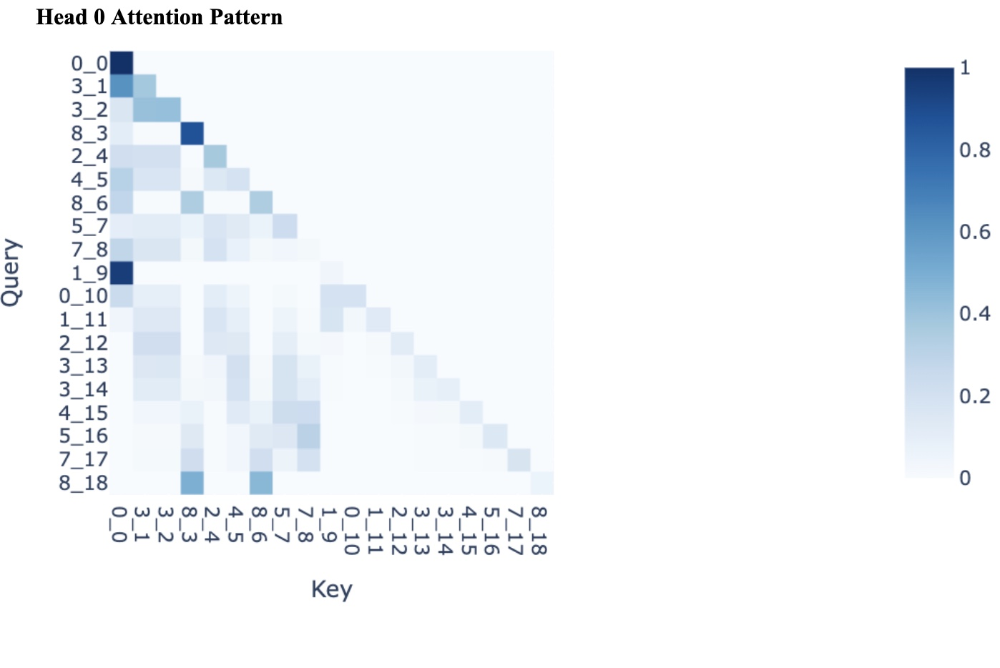

# Sorting-Transformer-Interp
A mechanistic interpretability project meant to analyze how a simple transformer learns to sort a sequence of 10 digits.

## High-level Overview

I trained a 1-layer, 1-head, attention-only transformer to sort a sequence of 10 digits. The transformer learned the task extremely well, earning over 99.8% accuracy on 10000 random examples- I then decided to try and figure out how the model was performing the task, taking inspiration from Nix Golodowsky-Dill’s interpretability work on Redwood’s balanced parentheses classifier model.

## Background and Initial Hypothesis

A few more details about the task and the model structure - the task was taken from Andrej Karpathy’s [minGPT repo](https://github.com/karpathy/minGPT/blob/master/demo.ipynb). The model is trained on essentially infinite data that’s randomly generated for each training batch. It was surprising to me that a one-layer attention-only transformer was able to perform the task and learn it very close to perfection - I tried slightly larger models with MLPs before scaling down and finding that this was sufficient. It also helped a lot (in terms of achieving convergence much earlier in training) when I used a separate unembedding matrix instead of tying the weights between the embedding and unembedding matrices - I think this generally seems like a sensible thing to do, even for standard language modeling, but in this case, it seems particularly sensible, since the layers are performing pretty distinct functions.

Before starting to try and understand the model, my hypothesis for how one might learn to sort in a vectorized way (credit to Neel Nanda for talking this over with me) was something like: learn ordering of digits (0 < 1 < 2 < …), and then keep track of the count of digits you saw in the input so that you output the correct number of them. Thinking about it some more, it makes sense that two layers (and therefore induction heads) are not needed to solve this task - the model doesn’t need to capture patterns in the input so much as keep track of what the input contains.

## Results

As far as I can tell, the model is doing something along these lines. It learns the ordering of the digits very easily, basically never failing at correctly ordering output tokens, but it often gets tripped up on repeated tokens in the input, sometimes failing to keep track of how many times they show up and dropping (e.g.) the 4th occurrence of a token. The training process was set up so that the model would run into cases of this form more often during training, but it still struggles when tokens start showing up more than 3 times or so in a sequence.

I’ll try to explain what I think the singular attention head is doing. An instructive image is that of its attention pattern on an input sequence. In the following image, the left number for each tick represents the actual digit, the right represents the position of that digit in the sequence.

The head seems to naturally learn the ordering of tokens and relative proximity of digits to one another, e.g. 0 is close to 1, 1 is close to 0 and 2, etc. The head looks back at the input sequence to try and figure out which tokens in the input are numerically close to the current token (either the same digit, or within +/- 1 of the digit) and therefore which ones it should output next, though the heads are smart enough to catch onto “jumps” from one digit to the next and thus pay attention to e.g. 8 and 7 key tokens in the input from a 5 query token when there are no 6s in the input.

The QK circuit generally corroborates this:

The top left corner basically shows the ordering/numerical proximity point (0 pays most attention to 0, 1 pays most attention to 1 and then 0). Positions 0-8 are fairly irrelevant, since they’re always just the (scrambled) input sequence, but at position 9, the model really likes token 0 and at position 18 the model really likes 9, since 0 is likely to start a sorted sequence (beginning at position 10) and 9 is likely to end a sorted sequence (ending at position 19).

I also tried to find some adversarial attacks, outside of just sequences with lots of repeated tokens. I didn’t have any amazing success here, though it does seem like big jumps in a sequence (e.g. 0, 0, 0, 7, 7, 8, 8, 9, 9, 9) cause the model to struggle and put an intermediate value (here, 5 or 6) in its guess at the sorted sequence - hard to tell if this is just another instance of the repeated token phenomenon or not, though, since large jumps basically imply repeated tokens.

## Future Directions

I’d be interested in digging into this model a bit more and seeing how it can be made more robust (can we get 100% accuracy)? The most promising form of adversarial attack is apparent (sequences with many repeated tokens), but I’d also be interested in figuring out exactly how to best train the model to defend against this sort of attack.

## Acknowledgements

Neel Nanda was a very helpful guide for this dive into mechanistic interpretability research - I also credit him significantly for pushing me to use his Easy Transformer Library. 

